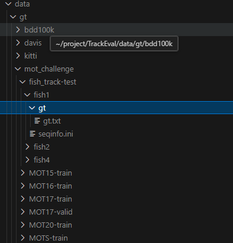
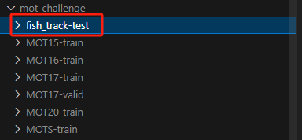
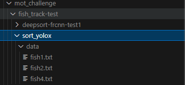

# 毕业论文代码仓库

## 本地安装

https://github.com/kuaizhiyan/FishTrack.git (修改的 mmdet，直接安装，不用安装官方的mmdet)

```bash
git clone https://github.com/kuaizhiyan/FishTrack.git
cd FishTrack
pip install -v -e .
```


## 一、数据集
### 1. 鱼类目标检测数据集
/share/Lab_Datasets/WEIZHOUYUTAI-COCO

dataset 配置文件：'./configs/_base_/datasets/weizhoudao_detection.py'

改造要点：
1. 按照 coco 格式组织数据集
2. 在 dataset 配置部分，通过 `metainfo=dict(classes=classes)` 修改数据集类别
3. 在 model 配置部分，修改所有 `bbox_head=(num_classes=?)` 中分类头的类别数

### 2. 鱼类跟踪数据集
/share/Lab_Datasets/fish_track
包含 3 个视频， 20,000 张图像，97 条鱼。已完成 MOTChallenge 格式和 mmdet 格式改造，可以正常使用。

### 3. 鱼类 ReID 数据集
1. 分类形式数据集
/share/Lab_Datasets/fish_reid
从  track_datasets 中截取出来的 ReID 数据集，用于训练 reid network. 97 条鱼每条鱼为一类，9:1 划分数据集。 这是按照分类任务制作的数据集。

2. mmdet 形式数据集
/share/Lab_Datasets/fish_track/reid

配置文件：./configs/_base_/datasets/fishtrack_reid.py


### TrackEval 评估
TrackEval 自定义数据集及评估方法： https://github.com/JonathonLuiten/TrackEval/tree/master/docs/MOTChallenge-Official


**在 TrackEval 中添加 BenchMark**

1. 在 mot_challenge 文件夹下创建 benchmark `fish_track-test` .
2. 每个文件夹下包含 `gt/gt.txt` 和 seqinfo.ini
```bash
|--fish_track-test
    |--fish1
        |--gt
            |--gt.txt
        |--seqinfo.ini
    |--fish2
    ...
```




**使用 TrackEval 评估**
1. 创建对应的 Benchmark 名称 + split 命名的文件夹：



2. 在文件夹下创建跟踪器名称，并将跟踪结果放置在 data 路径下
```bash
|--mot_challenge
    |--fish_track-test
        |--sort_yolox
            |--data
                |--fish1.txt
                |--fish2.txt
                |--fish4.txt

```


3. 执行评估命令

```bash
python scripts/run_mot_challenge.py --BENCHMARK fish_track --SPLIT_TO_EVAL test --TRACKERS_TO_EVAL sort_yolox
```


## 二、 训练

### 1. 目标检测器

yolox_s 配置文件：./configs/yolox/yolox_s_8xb8-weizhoudao.py

权重文件：[Google Drive](https://drive.google.com/file/d/1w9xUgDkQzTwKqjlbg1CceJnFowY1Kvsy/view?usp=drive_link)

权重文件（本地）：/share/Lab_Datasets/kzy/models/best_weizhoudao_coco_bbox_mAP_epoch_103.pth

训练指令： 
```bash
python tools/train.py ./configs/yolox/yolox_s_8xb8-weizhoudao.py
```

### 2. reid 网络
reid 网络的训练，在 mmpretrain 中进行，然后在 mmdet 中加载权重，完成跟踪。

#### GEA 数据增强

配置文件：configs/reid/reid_r50_fishreid_dataaug.py

模型文件：mmdet/datasets/transforms/gea.py

工作空间：/home/kzy/project/PartDecoder/mmdetection/work_dirs/reid_r50_fishreid_dataaug

训练指令：
```bash
python tools/train.py configs/reid/reid_r50_fishreid_dataaug.py
```

权重文件：[Google Drive](https://drive.google.com/file/d/139Sd3m6s54KMHcK1gFXKDpM00EwnCNtJ/view?usp=drive_link)

权重文件（本地）：/share/Lab_Datasets/wd/gea/gea2.pth

#### MPE 多路径增强

配置文件： configs/reid/reid_r50_fishreid_attention.py

模型文件：fishtrack/model/MPE.py

工作空间： /home/kzy/project/PartDecoder/mmdetection/work_dirs/reid_r50_fishreid_attention

权重文件（本地）:

权重文件：

命令：
```bash
python tools/train.py configs/reid/reid_r50_fishreid_attention.py
```

#### PMNet

配置文件：configs/reid/reid_pmnet_fishreid.py

模型文件：fishtrack/model/pamstransformer.py

权重文件（本地）：/share/Lab_Datasets/kzy/models/3L_13q_2L_wemb_0.79mAP.pth

权重文件：[Google Drive](https://drive.google.com/file/d/1Q8ESv9LDfjpbIKQb5lpIOQt_1cPIuP5T/view?usp=drive_link)


### 3. 跟踪器（数据关联算法）

模型文件：

权重文件（全流程）（本地）：

权重文件（全流程）：


## 三、 测试
### 1. 在 fish_track 数据集上进行完整测试

ps: 
``` bash
mmdetection  官方源码在 test_tracking.py 执行时，预处理流程可能与 image_demo.py 不同，暂时没有找到引起差别的地方。

采用相同的配置文件和权重文件，输入特征图 x 不同，导致 test_tracking 检测器预测输出为空，可见度几乎为 0. 

此方法暂时弃用。
```

配置文件：./configs/deepsort/deepsort_yolox-s_100e_fishtrack.py

测试命令：

格式：
```bash
python tools/test_tracking.py 
config
--detector # detector checkpoint
--reid # reid checkpoint
```

数据增强案例：
```bash
 python tools/test_tracking.py \
 configs/deepsort/deepsort_yolox-s_dataaug.py \
 --detector /home/kzy/project/PartDecoder/mmdetection/models/best_weizhoudao_coco_bbox_mAP_epoch_103.pth  \
 --reid /home/kzy/project/PartDecoder/mmdetection/work_dirs/reid_r50_fishreid_dataaug/gridmask.pth
```


```bash
 python tools/test_tracking.py ./configs/deepsort/deepsort_yolox-s_100e_fishtrack.py
```

### 2. Tracking pipeline 方法测试

按照 `mmtracking_open_detection` 中 `tracking_deepsort` 方法思路，单独加载检测器配置文件，可以实现正常检测。

**检测单个文件夹**
```bash
 python fishtrack/tools/tracking_pipeline.py /share/Lab_Datasets/fish_track/train/fish1/img1/ /home/kzy/project/PartDecoder/mmdetection/configs/yolox/yolox_s_8xb8-fishtrack_detection.py models/best_fishtrackcoco_bbox_mAP_epoch_30.pth --out-dir work_dirs/tracking_pipeline_3101515 --tracker-path /home/kzy/project/PartDecoder/mmdetection/configs/sort/sort_yolox_s_fish_track.py
```

**完整 FishTrack 测试**

ps: 目前可视化等功能还没有调试。

使用这段代码，将生成 TrackEval 格式的评估文件，直接复制输出路径至 TrackEval 即可评估.
```bash
python fishtrack/tools/track_folder.py /share/Lab_Datasets/fish_track/ /home/kzy/project/PartDecoder/mmdetection/configs/yolox/yolox_s_8xb8-fishtrack_detection.py models/best_fishtrackcoco_bbox_mAP_epoch_30.pth  --out-dir work_dirs/sort_yolox_1742 --tracker-path /home/kzy/project/PartDecoder/mmdetection/configs/sort/sort_yolox_s_fish_track.py
```
评估命令（详细见上文）：
```bash
python scripts/run_mot_challenge.py --BENCHMARK fish_track --SPLIT_TO_EVAL test --TRACKERS_TO_EVAL sort_yolox
```


## 四、开放集跟踪

1.安装 MMLab playground ：https://github.com/open-mmlab/playground （当前只安装 grouding dino即可）

2.创建 `models` 文件夹存放权重，并下载 grounding dino 权重
```bash
|-mmtracking_open_detection
|-models
    |-groundingdino_swinb_cogcoor.pth
```

3.运行指令
```bash
cd ./mmtracking_open_detecton
```
使用 `--text-prompt`参数显式指定分类文本，'--tracker-path' 指定多模态跟踪器的配置文件路径
```bash
python tracking_mmdeepsort.py "../tracking_demo/bdd_val_track" "configs/GroundingDINO_SwinB.cfg.py" "../models/groundingdino_swinb_cogcoor.pth"  --text-prompt "person . rider . car . truck . bus . train . motorcycle . bicycle ." --out-dir "outputs/mmdeepsort_textprompt" --fps 30 --tracker-path ./configs/mmdeepsort_tracker.py
```

使用 `--category-file`参数显式指定分类文本，'--tracker-path' 指定多模态跟踪器的配置文件路径
```bash
python tracking_mmdeepsort.py "../tracking_demo/bdd_val_track" "configs/GroundingDINO_SwinB.cfg.py" "../models/groundingdino_swinb_cogcoor.pth"  --category-file categories.txt --out-dir "outputs/mmdeepsort_catetxt" --fps 30 --tracker-path ./configs/mmdeepsort_tracker.py
```


## 五、 数据可视化

### 1. 数据集可视化
官方教程：[可视化数据集](https://mmdetection.readthedocs.io/zh-cn/latest/user_guides/useful_tools.html#id4)

命令：
```bash
python tools/analysis_tools/browse_dataset.py \
    configs/_base_/datasets/weizhoudao_detection.py \
    --output-dir ./work_dirs/dataset_vis
```

ps: 若报错：
```bash
AttributeError: 'ConfigDict' object has no attribute 'visualizer'
```

请将`configs/_base_/datasets/weizhoudao_detection.py` 配置文件中最下方的 `vis_backends` `visualizer` 注释解除。

注意其他配置文件继承此数据集配置文件时，`visualizer` 的冲突问题，根据具体任务注释掉或覆盖。

报错示例:
```bash
KeyError: "Duplicate key is not allowed among bases. Duplicate keys: {'visualizer', 'vis_backends'}"
```


### 2. 训练过程可视化
官方教程：https://mmdetection.readthedocs.io/zh-cn/latest/user_guides/useful_tools.html#

以下是本项目简要的运行示例

### 3. 检测可视化

官方教程：[绘制检测结果](https://github.com/open-mmlab/mmdetection/blob/main/docs/zh_cn/user_guides/inference.md)

可以使用 图片/图片路径

```bash
python demo/image_demo.py data/fish_track/train/fish2/img1/1.jpg \
    configs/yolox/yolox_s_8xb8-weizhoudao.py \
    --weights models/best_weizhoudao_coco_bbox_mAP_epoch_103.pth 
```

```bash
python demo/image_demo.py data/fish_track/train/fish2/img1/ configs/yolox/yolox_s_8xb8-fishtrack_detection.py --weights models/best_fishtrackcoco_bbox_mAP_epoch_30.pth --out-dir /share/Lab_Datasets/kzy/track_detection_vis/fish2/
```

### 4. 跟踪结果可视化
官方教程： [link](https://github.com/open-mmlab/mmdetection/blob/main/docs/zh_cn/user_guides/tracking_visualization.md)

### 5. 跟踪视频可视化
配置文件：./configs/deepsort/deepsort_yolox-s_100e_fishtrack.py

官方教程：[link](https://github.com/open-mmlab/mmdetection/blob/main/docs/zh_cn/user_guides/tracking_interference.md)

测试命令：

生成视频
```bash
python demo/mot_demo.py \
    data/fish_track/train/fish2/img1 \
    configs/deepsort/deepsort_yolox-s_100e_fishtrack.py \
    --detector \
    models/best_fishtrackcoco_bbox_mAP_epoch_30.pthyolox_s_8xb8-weizhoudao/best_coco_bbox_mAP_epoch_103.pth \
    --out work_dirs/fish2.mp4 --fps 20
```
生成文件夹
```bash
python demo/mot_demo.py data/fish_track/train/fish1/img1/ configs/deepsort/deepsort_yolox-s_dataaug.py --detector models/be
st_fishtrackcoco_bbox_mAP_epoch_30.pth --out fish1/
```

### 6. 类激活图可视化

mmpretrain 官方教程： [MMPretrain 类激活图可视化](https://mmpretrain.readthedocs.io/zh-cn/dev/useful_tools/cam_visualization.html)


## 脚本文件

1. 本项目使用到的 Model 等文件，（项目中已经配置好可以运行，放在这里是为了直观的看到核心代码）
2. 一些用到的工具脚本


